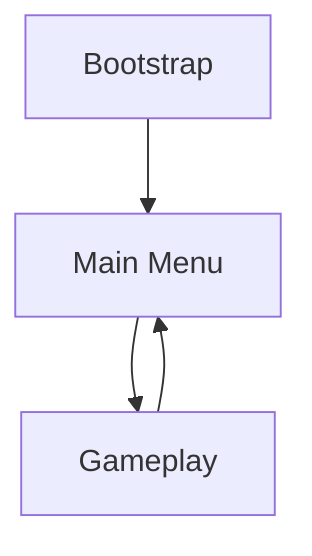

# BaseArchitecture

A reusable Unity architecture template for projects that need a clean application flow, dependency injection, scene-based state management, UI windows, popups, input services, save/load infrastructure, and scalable project organization.

This repository is not a complete game. It is a technical foundation that can be reused across gameplay prototypes, portfolio projects, and small to mid-sized Unity games.

The project is built around explicit app states, VContainer lifetime scopes, centralized scene loading, Addressables-based UI, and service-oriented systems.

---

## Project Goals

The goal of this project is to provide a practical Unity base architecture without turning it into an overcomplicated framework.

It focuses on:

* Clear high-level application flow
* Controlled object lifetimes through dependency injection
* Separation between global systems and feature-specific systems
* Centralized scene loading and transitions
* Reusable UI window and popup infrastructure
* Input abstraction over Unity's New Input System
* Replaceable save/load storage
* Cleaner folder and assembly organization
* A structure suitable for real projects and portfolio demonstration

---

## Unity Version

The project was created with:

```text
Unity 6000.3.14f1
```

---

## Main Packages and Tools

The project currently uses the following main packages and systems:

* **VContainer** — dependency injection and lifetime scopes
* **UniTask** — async operations in Unity
* **R3** — reactive event flow
* **Addressables** — async asset, prefab, and UI loading
* **Unity Input System** — gameplay and UI input handling
* **URP** — rendering pipeline
* **UGUI** — UI system
* **Cinemachine** — camera tools
* **Newtonsoft JSON** — JSON serialization
* **NuGetForUnity** — package integration
* **Unity Test Framework** — testing support

---

## Architecture Overview

The project is organized around a global application state machine.

Instead of allowing scenes, buttons, or gameplay objects to directly decide how the whole application moves between screens and modes, the project uses explicit app states.

Current app states:

```text
Bootstrap
MainMenu
Gameplay
```

Each state can define:

* Which scenes it needs
* Which dependencies it registers
* Which controller runs the state logic
* Which UI should be opened
* Which state should be entered next

Basic flow:



The global flow is coordinated by `AppStateMachine`, while state-specific logic is handled by dedicated app state controllers.

---

## Core Idea

The architecture separates the project into three major layers:

```text
Core            reusable systems and contracts
Features        concrete game/application states and feature logic
Infrastructure  dependency injection and factories
```

This separation helps keep reusable systems independent from concrete gameplay features.

For example:

* `Core` contains app state contracts, scene management, input, save, audio, UI, and settings systems.
* `Features` contains state-specific logic such as Bootstrap, Main Menu, and Gameplay.
* `Infrastructure` contains composition root code and factories that wire the project together.

---

## App State Machine

`AppStateMachine` is the central coordinator of the application flow.

Its responsibilities include:

* Starting the application flow
* Initializing persistent scenes
* Switching between app states
* Preventing overlapping transitions
* Showing and hiding transitions
* Loading state scenes
* Creating state lifetime scopes
* Resolving state controllers
* Running the active state
* Disposing the previous state safely

The state machine does not contain feature-specific UI or gameplay logic. It only coordinates the flow.

A simplified transition looks like this:

```text
Show transition
Exit current state
Load next state scenes
Create child lifetime scope
Resolve next state controller
Enter next state
Hide transition
Run state
Wait for exit result
Repeat if another state is requested
```

This keeps app-level logic predictable and prevents scene loading, UI flow, and dependency setup from being scattered across the project.

---

## App State Controllers

Each app state has its own controller.

Examples:

```text
BootstrapAppStateController
MainMenuAppStateController
GameplayAppStateController
```

A state controller owns only the logic of its specific state.

For example, a Main Menu state controller can:

* Open the main menu window
* Initialize the main menu presenter
* Wait for the Play button action
* Return an exit result that requests the Gameplay state

A controller can return an `AppStateExitResult` to tell the state machine what should happen next.

Example idea:

```text
AppStateExitResult.SwitchTo(AppStateId.Gameplay)
```

This makes transitions explicit and easy to follow.

---

## State Exit Results

App states communicate the next transition through `AppStateExitResult`.

An exit result can contain:

* The next app state
* Optional payload data
* Optional switch options
* Optional transition callbacks
* Optional progress callback

This allows state transitions to stay flexible without hardcoding special cases into the state machine.

For example, one state can request another state while also passing data or transition options.

---

## Dependency Injection with VContainer

The project uses **VContainer** as its dependency injection solution.

There are two main lifetime levels:

1. Root lifetime scope
2. State lifetime scopes

---

### Root Lifetime Scope

`RootLifetimeScope` is the composition root of the project.

It registers long-living systems such as:

* Scene loading service
* App scene registry
* App scene coordinator
* App transition service
* App state machine
* App state controller factory
* App state scope builder
* Input service
* Input gate
* Settings service
* Save system
* Audio service
* Window service
* Popup service
* App lifecycle service
* EventSystem and UI input module

The root scope is persistent and is not recreated during normal state transitions.

This makes it a good place for services that should exist for the whole application lifetime.

---

### State Lifetime Scopes

Every app state can create its own child lifetime scope.

State scopes are used for dependencies that should exist only while a specific state is active.

For example, the Gameplay state can register gameplay-specific services, presenters, controllers, and runtime data.

When the app leaves the Gameplay state, the state scope is disposed.

This helps with:

* Cleaner cleanup
* Fewer hidden references
* Better separation between states
* Safer feature-specific dependency lifetimes

---

## State Installers

Feature dependencies are registered through state installers.

Each state scene can contain an installer implementing the app state installer contract.

A state installer can:

* Clean up old scene objects before installation
* Register state-specific dependencies
* Provide controllers, presenters, models, views, and services for the active state

The state scope builder collects installers from loaded scenes and uses them to create a child VContainer scope.

This allows each feature to own its dependency registration instead of putting every dependency into the root scope.

---

## Scene Management

Scene loading is centralized in the scene management system.

Main concepts:

```text
IAppSceneRegistry
IAppSceneCoordinator
ISceneLoadService
AppSceneDatabase
```

The scene registry describes which scenes belong to each app state.

The scene coordinator applies the required scene changes when the application switches states.

This means state controllers do not need to manually load and unload scenes.

A state transition can focus on intent:

```text
Switch to Gameplay
```

The scene system handles the scene details behind that request.

---

## Transitions

The project includes an app transition service.

The current transition implementation creates a persistent screen-space overlay and fades it in or out during state changes.

This gives the app a consistent transition layer without requiring a separate loading scene.

The transition system is used by the app state machine when switching between states.

---

## UI Window System

The UI architecture is based on reusable windows.

Main concepts:

```text
IWindowService
AddressableWindowFactory
BaseWindow
WindowServiceConfig
```

The window service is responsible for opening and closing UI windows.

Addressables are used to load window prefabs, which keeps UI screens less dependent on concrete Unity scenes.

Typical windows can include:

* Main menu window
* Settings window
* Gameplay HUD
* Pause window
* Loading window
* Confirmation popup
* Message popup

This keeps UI creation out of the state machine and lets presenters or state controllers request UI through services.

---

## Popup System

The project includes a popup layer with separate popup handling.

Current popup-related systems include:

* Popup service
* Timed popup handler
* Confirmation popup handler
* Message popup handler

This allows temporary UI messages, confirmations, and modal interactions to be handled through a shared service instead of being implemented separately in every feature.

---

## Input System

Input is handled through a service layer over Unity's New Input System.

Main responsibilities:

* Centralized input access
* Gameplay/UI input mode control
* UI navigation through EventSystem
* Input gating when UI or transitions block gameplay
* Cleaner separation between player logic and raw input actions

This makes it easier to change input bindings, support gamepad navigation, and prevent gameplay input from leaking into UI states.

---

## Save System

The save system is designed around replaceable storage.

Main concepts:

```text
ISaveSystem
ISaveStorage
JsonService
FileSaveStorage
PlayerPrefsSaveStorage
```

The storage backend can be selected through dependency injection.

The project supports a compile-time switch:

```text
USE_PLAYER_PREFS_SAVE
```

When the symbol is enabled, the save system uses PlayerPrefs storage.

Otherwise, it uses file-based save storage.

This makes the save system easier to adapt for different platforms and project requirements.

---

## Audio System

The project includes an audio service registered through the root lifetime scope.

Audio configuration is stored in ScriptableObject-based config assets.

Current audio-related concepts include:

* Audio service
* Audio database
* Audio service config
* UI sound player

This keeps audio playback centralized and avoids scattering direct AudioSource management across UI and gameplay classes.

---

## Folder Structure

Current high-level structure:

```text
Assets/
  AddressableAssetsData/
  Art/
  Configs/
  Packages/
  Plugins/
  Prefabs/
  Resources/
  Scenes/
  Scripts/
  Settings/
  StarterAssets/
  TextMesh Pro/
  InputActions.inputactions
```

Main script structure:

```text
Assets/
  Scripts/
    Core/
      AppStates/
      Application/
      Audio/
      Coroutines/
      Input/
      Patterns/
      Save/
      SceneManagement/
      Settings/
      UI/

    Features/
      Bootstrap/
      Gameplay/
      MainMenu/
      Shared/

    Infrastructure/
      DI/
      Factories/
```

The most important rule is dependency direction:

```text
Features can depend on Core contracts.
Core should not depend on concrete Features.
Infrastructure wires everything together.
```

---

## Bootstrap Feature Example

The Bootstrap feature shows the intended state feature structure.

It contains:

```text
BootstrapAppStateController
BootstrapAppStateInstaller
BootstrapModel
BootstrapPresenter
BootstrapView
Startup
```

This demonstrates the general pattern used by app states:

* The controller manages state lifecycle.
* The installer registers dependencies.
* The presenter coordinates view logic.
* The model stores state-specific data.
* The view owns Unity UI references.

---

## How to Add a New App State

A new app state can be added using the following process:

1. Add a new value to `AppStateId`.
2. Add required scenes to the app scene database.
3. Create a new state controller.
4. Create a state installer for feature dependencies.
5. Register the controller in `AppStateControllerFactory`.
6. Add UI windows, presenters, and services needed by the state.
7. Return `AppStateExitResult.SwitchTo(...)` when the state should transition somewhere else.

Example:

```text
AppStateId.Gameplay
GameplayAppStateController
GameplayAppStateInstaller
AppStateExitResult.SwitchTo(AppStateId.MainMenu)
```

---

## Why This Architecture

Unity projects often become hard to maintain when:

* Scenes directly load other scenes
* UI buttons control global flow
* Gameplay systems create global services manually
* Dependencies are pulled from static singletons
* Cleanup depends on scene destruction only
* Save/load logic is called from random places
* Input is read directly by many unrelated classes

This architecture solves those problems by making responsibilities explicit:

* `AppStateMachine` controls high-level flow.
* `IAppSceneCoordinator` controls scene changes.
* `RootLifetimeScope` registers global services.
* State installers register feature-specific dependencies.
* `IWindowService` controls UI windows.
* Popup service controls shared popups.
* Input service controls input access and modes.
* Save system controls persistence.

The result is a base project that can grow without turning into a collection of tightly coupled scene scripts.

---

## Getting Started

1. Clone the repository.
2. Open the project in Unity `6000.3.14f1` or a compatible Unity 6 version.
3. Restore packages through Unity Package Manager.
4. Open the Bootstrap scene.
5. Enter Play Mode.
6. Follow the application flow from Bootstrap to Main Menu and Gameplay.

---

## Good Use Cases

This architecture is useful for:

* Portfolio game projects
* Gameplay prototypes
* Small commercial prototypes
* Menu-driven Unity games
* Projects with multiple scenes and UI states
* Projects that need cleaner DI and lifetime management
* Projects where Addressables-based UI loading is useful

---

## Current Status

Implemented or partially implemented systems include:

* Global app state machine
* Bootstrap, Main Menu, and Gameplay app states
* VContainer root lifetime scope
* VContainer state child scopes
* State installer workflow
* App state controller factory
* Centralized scene management
* Transition overlay
* Addressables-based window factory
* Window service
* Popup service and popup handlers
* Input service and input gate
* Save system abstraction
* File and PlayerPrefs save storage options
* Audio service setup
* Settings service setup

---

## Roadmap

Possible future improvements:

* Add more example app states
* Add more complete gameplay sample
* Add tests for pure C# services
* Add documentation for creating new windows
* Add documentation for creating new app states
* Add debug UI for current app state and loaded scenes
* Add more sample popups
* Add save/load usage examples
* Add architecture diagrams

---

## Portfolio Focus

This repository is intended to demonstrate Unity architecture skills, including:

* App state design
* Dependency injection with VContainer
* Lifetime scope management
* Async scene loading
* Addressables workflow
* UI window architecture
* Popup handling
* Input architecture
* Save/load abstraction
* Clean separation between core systems and features

The goal is not to show a large framework. The goal is to show a practical and reusable foundation that can support real Unity projects.

---

## License

This project is licensed under the MIT License. See the [LICENSE](LICENSE) file for details.

